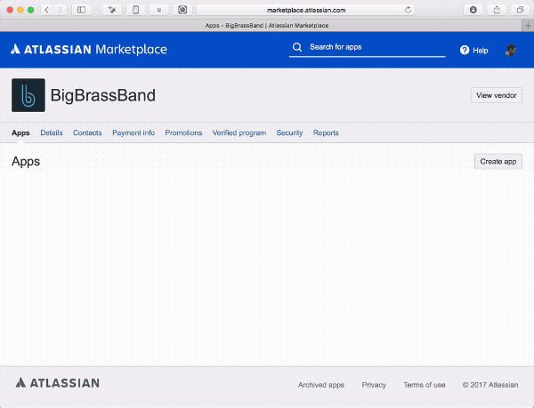

Atlassian Marketplace Remittance Reconciliation Utility
=======================================================

*Copyright 2017 [BigBrassBand LLC](https://marketplace.atlassian.com/plugins/com.xiplink.jira.git.jira_git_plugin/cloud/overview)*

This utility compares an Atlassian remittance report PDF with a transactions
JSON file and prints differences found. The remittance report PDF has had some
format changes over the years --- this utility works with the latest format as
of October 2017. It requires that you have Java installed.

Need help? E-mail us -- support atsymbol bigbrassband period com. 

The utility looks at all sales and refunds for the period in the PDF cross
referenced against that time period in the JSON file.

Any unmatched rows are printed:

1.  Sales listed in the JSON file that are not matched in the PDF. Manually
    check to see if this are sales for which you were not paid.

2.  Sales listed in the PDF file that are not matched in the JSON file. Manually
    check to see if these are sales you have not really made and should not have
    been paid.

3.  Refunds listed in the JSON file that are not matched in the PDF. Manually
    check to see if these are refunds that Atlassian may have not taken out of
    the remittance but appear they should have.

4.  Refunds listed in the PDF that are not matched in the JSON. Manually check
    to see if there se are refunds that Atlassian has taken out of the
    remittance but perhaps should not have.

 

Sample report
-------------

~~~~~~~~~~~~~~~~~~~~~~~~~~~~~~~~~~~~~~~~~~~~~~~~~~~~~~~~~~~~~~~~~~~~~~~~~~~~~~~~
Reconciliation for 9/1/2017 - 9/30/2017

1. Transaction API Sales Missing from Remittance Report PDF:
    AT-12345678 - 2017-09-06 - $12.34
        Upgrade - Per Unit Pricing (35 users) - Cloud
    AT-98765432 - 2017-09-05 - $5.67
        Renewal - 10 Users - Server
Total: $17.94

2. Remittance Report PDF Sales Missing from Transactions API:
    NO DATA MISSING

3. Transaction API Refunds Missing from Remittance Report PDF (heuristic*):
    12345 - 2017-09-14 - $-123.45
    67890 - 2017-09-11 - $-1,234.00
Total: $-1,357.45

4. Remittance Report PDF Refunds Missing from Transactions API (heuristic*):
    9/29/2017   Bill Credit #RF-123456789  $-123.00
Total: $-123.00

Total variance (1. Transaction API Sales Missed - 2. Remittance PDF Sales Missed + 3. Remittance PDF Refunds Missed - 4. Transaction API Refunds Missed ): $-1,216.51

* Matched based on amount and date. No transaction ID matches between remittance PDF and the transactions API.
~~~~~~~~~~~~~~~~~~~~~~~~~~~~~~~~~~~~~~~~~~~~~~~~~~~~~~~~~~~~~~~~~~~~~~~~~~~~~~~~

 

How to Use
----------

**Step 1.** Download your current Transactions JSON file.

**Step 2.** Every month in e-mail you get a remittance PDF file. Place this in
the same directory as the JSON file.

**Step 3.** Save the *remittanceparse.jar* file into the same directory as the
JSON file and PDF. The remittanceparse.jar file can be [downloaded
here](https://github.com/BigBrassBand/remittanceparse/raw/master/remittanceparse.jar).

**Step 4.** From a command line in the directory where are the files are, run
this command:

`java -Xmx1G -jar remittanceparse.jar "2017-10-Bill Payment_00001234_2.pdf" transactions-123456-20171106T115952Z.json`

*Update the filenames of the PDF and JSON files to match the filenames you
have.*

 

 

 
